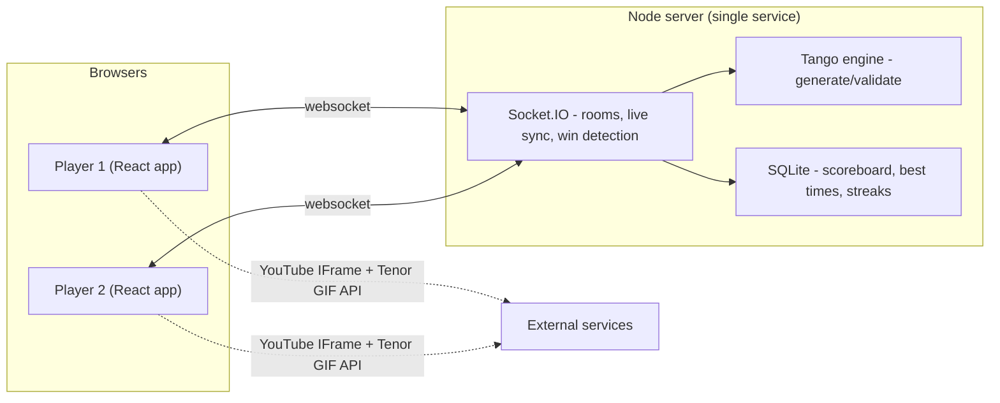

# Tango for Two - Design Doc

Date: 2026-07-22
Status: Approved (pending spec review)

## Overview

A private, two-player website for playing unlimited [Tango](https://www.linkedin.com/games/tango/) (the LinkedIn logic puzzle) together. One partner creates a room and shares a link; the other joins. No accounts, no passwords. The pair chooses a mode (Race or Co-op) and a difficulty (Easy/Medium/Hard), and a fresh, guaranteed-unique puzzle is generated for every match.

The experience is intentionally cute and romantic: a "Dreamy Pastel" look (pink + lavender gradients, soft glow, sparkles), a selectable symbol pair (defaulting to a bee and blue flower instead of the original sun/moon), floating emoji + GIF reactions, a shared synced music jukebox defaulting to Bruno Mars, and a persistent per-room scoreboard (win tally, streaks, best solve times). The landing page is personalized specifically for the two people who play it.

## Goals

- Unlimited, always-valid Tango puzzles via a generator (not a fixed puzzle bank).
- Real-time two-player play, with **Race** as the primary mode and **Co-op** as secondary.
- Delightful, personal, low-friction: join by link, cute theme, reactions, shared music.
- Small, cheap, self-hosted footprint suitable for two people.

## Non-Goals (YAGNI)

- No user accounts, profiles, or login.
- No text chat or voice (reactions only).
- No matchmaking, lobbies, or support for more than two players per room.
- No board sizes other than classic 6x6 (no 8x8 variant for now).
- No mobile app (responsive web is enough).

## Decisions

| Topic | Decision |
| --- | --- |
| Multiplayer modes | Race (priority) + Co-op, both real-time |
| Puzzle supply | On-the-fly generator with uniqueness guarantee |
| Symbols | Selectable pair from a shared palette; default bee + blue flower. Palette: bee, blue flower, shokupan, salt bread, matcha, boba, ice cream |
| Aesthetic | Dreamy Pastel (pink/lavender gradients, glossy, sparkles) |
| Music | Shared synced jukebox (YouTube), default Bruno Mars playlist, paste any link |
| Communication | Reactions only: floating emoji + GIF overlays |
| Connecting | Create room -> share link/code -> partner joins; no accounts |
| Landing page | Personalized for the couple: photo, names greeting, days-together counter, rotating Bruno Mars lyric, pick-who-you-are (no name typing) |
| Difficulty | Easy / Medium / Hard; classic 6x6 |
| Scoreboard | Persistent per-room: win tally, streaks, best solve times |
| Game layout | Side-by-side (your board + partner's live mini-board) |
| Tech approach | Self-contained full-stack app (React + Vite + Node/Socket.IO + SQLite) |
| GIF provider | Tenor API (free key) |

## The Tango Engine (shared TypeScript module)

A framework-agnostic module in `shared/` used by both the client (rendering, live validation hints) and the server (authoritative generation + win validation).

### Rules

- 6x6 grid; every cell holds one of two symbols (bee or flower).
- Each row and each column contains exactly 3 bees and 3 flowers.
- No more than 2 identical symbols consecutively in any row or column (no 3-in-a-row).
- Edge constraints between orthogonally adjacent cells: `=` (the two cells must be the same symbol) and `x` (the two cells must differ).
- A valid puzzle has exactly one solution.

### Solver

- Constraint propagation (apply forced deductions from balance, no-3-in-a-row, and edge constraints) plus backtracking search.
- Can count solutions up to 2 (used for uniqueness checks) and validate a completed board.

### Generator

1. Generate a random valid full solution grid (backtracking honoring balance + no-3-in-a-row).
2. Derive candidate clues (pre-filled cells) and candidate edge constraints (`=`/`x`) consistent with the solution.
3. Iteratively remove clues/constraints, re-running the solver to ensure the puzzle remains uniquely solvable.
4. Difficulty tuning: Easy leaves more clues and requires only simple deductions; Hard leaves fewer clues and requires deeper propagation. Difficulty is validated by the solver's deduction depth / remaining-clue count.

### Types (illustrative)

```ts
type Symbol = 'bee' | 'flower';
type Cell = Symbol | null;
type Grid = Cell[][]; // 6x6
type EdgeConstraint = { a: [number, number]; b: [number, number]; kind: '=' | 'x' };
interface Puzzle {
  id: string;
  clues: Grid;                 // fixed given cells (others null)
  constraints: EdgeConstraint[];
  difficulty: 'easy' | 'medium' | 'hard';
}
interface Solution { grid: Grid; }
```

## Architecture



- **Frontend:** React + Vite + TypeScript, Tailwind CSS (Dreamy Pastel theme tokens), custom SVG icons for bee + blue flower, zustand for local state, socket.io-client.
- **Backend:** Node + TypeScript, Express + Socket.IO, better-sqlite3.
- **Shared:** the Tango engine (generator, solver, rules, types) imported by both.
- **Persistence model:** live match state (current boards, timer) lives in server memory; only durable scoreboard data (wins, streaks, best times) is written to SQLite, keyed by room code.
- **Deployment:** single service serving the built static frontend + the Socket.IO server, on Render / Railway / Fly.io (free tier, WebSocket-friendly).

### Suggested repo layout

```
tango-multiplayer/
  shared/        # tango engine: rules, solver, generator, types (+ tests)
  server/        # express + socket.io + sqlite
  client/        # react + vite frontend
  docs/
```

## Real-Time Data Flow

### Room lifecycle

- `createRoom` -> server mints a short room code, returns a shareable link.
- `joinRoom(code)` -> validates code, seats the second player.
- On join, each player sets a display name + avatar (a bee or flower); stored in memory for the session.

### Race mode

1. A player picks difficulty + Race and starts the match.
2. Server generates one puzzle, sends the same puzzle to both, starts the timer.
3. Each player edits their **own** board. Each cell change updates their board and broadcasts a progress signal (e.g. % filled) so the partner's live mini-board updates.
4. Server holds the solution. When a player's board is complete and correct, the server declares the winner, stops the timer, records the solve time, and updates the scoreboard (win tally, streak, best time).
5. Win celebration animation on both screens.

### Co-op mode

- One shared board. Every cell change is synced to both players instantly. Completion is celebrated jointly (solve time recorded, no winner).

### Reactions

- Emoji or GIF (Tenor) is broadcast to the room as an ephemeral event and rendered as a floating overlay animation. Not persisted.

### Shared synced jukebox

- Both browsers embed a YouTube player showing the same track.
- Either player can play / pause / skip / paste a new link; the action broadcasts via Socket.IO with a server timestamp.
- Receiving clients seek to the correct position using the timestamp offset; a periodic re-sync corrects drift.
- Default content is a Bruno Mars playlist.

### Symbol selection

- The engine's two logical states remain `bee` / `flower`; a chosen **symbol pair** only changes rendering. This keeps the generator/solver symbol-agnostic.
- A shared palette of icon keys: `bee`, `blueFlower`, `shokupan`, `saltBread`, `matcha`, `boba`, `iceCream`.
- Either player can pick any two icons (a `SymbolPair` mapping logical `bee` -> icon A and `flower` -> icon B). The choice is stored on the room and broadcast so both players see identical symbols. Default pair is bee + blue flower. Selectable on the landing page and before any match.
- `bee` and `blueFlower` render as custom SVGs; food icons render as crisp emoji-style glyphs.

### Socket events (illustrative)

- Client -> server: `createRoom`, `joinRoom`, `startMatch`, `cellUpdate`, `reaction`, `musicControl`, `setSymbols`.
- Server -> client: `roomState` (includes players, scores, match, and current `symbols`), `matchStarted`, `opponentProgress`, `coopCellUpdate`, `matchWon`, `reaction`, `musicSync`, `partnerDisconnected`, `errorMsg`.

## Persistence (SQLite)

- `rooms(code, created_at)`
- `scores(room_code, player_slot, wins, streak, best_time_ms)`
- Match/board state is intentionally NOT persisted (ephemeral, in-memory) - simpler and privacy-friendly.

## Error Handling & Edge Cases

- Socket.IO auto-reconnect; server retains room state briefly so a mid-race disconnect can resume.
- Friendly errors for invalid / expired room codes and a "waiting for partner to reconnect" state.
- Live rule-conflict highlighting on the board (like real Tango) so mistakes are visible while solving.
- Generator always verified to produce a uniquely solvable puzzle before it is served.
- Music sync gracefully degrades: if one client fails to load YouTube, the game continues unaffected.

## Personalization

The landing page is tailored to the specific couple. All personal content lives in one editable config file (`client/src/config/personal.ts`) so nothing personal is hard-coded across the app and it can be changed anytime:

- A **couple photo** centerpiece (image dropped in `client/public/`).
- A **greeting** using both names ("Welcome back, Rosie & Sam").
- A **days-together counter** computed from an anniversary date.
- A **rotating quote** picked from a list of favorite Bruno Mars lyrics / inside jokes.
- **Pick-who-you-are**: two preset player buttons (name + icon each) replace the "type your name" step. Tapping one sets your identity, then you create or join a room.

Config shape (illustrative):

```ts
export const personal = {
  players: [
    { id: 'p1', name: 'Rosie', icon: 'blueFlower' },
    { id: 'p2', name: 'Sam', icon: 'bee' },
  ],
  anniversary: '2022-06-18', // YYYY-MM-DD
  photoSrc: '/couple.jpg',   // in client/public
  quotes: ['I think I wanna marry you', 'You can count on me like 1, 2, 3'],
};
```

## UI Components

Personalized Landing (couple photo, greeting, days counter, rotating lyric, pick-who-you-are, symbol picker, create/join) and Game screen. Components:

- `Board`, `Cell`, `ConstraintMark` (`=` / `x` between cells)
- `SymbolPicker` (choose the two icons; shared/synced)
- `OpponentMiniBoard` (live progress), `Timer`, `Scoreboard` (tally / streak / best time)
- `DifficultyPicker`, `ModeToggle` (Race / Co-op)
- `ReactionsBar`, `FloatingReactions`, `GifPicker` (Tenor)
- `MusicPlayer` (shared jukebox), `WinCelebration`
- Icon registry mapping symbol keys (`bee`, `blueFlower`, `shokupan`, `saltBread`, `matcha`, `boba`, `iceCream`) to renderers

## Testing Strategy

- Unit tests: generator (always valid + uniquely solvable), solver (correctness + solution counting), rule checker.
- Component tests: board interaction and win detection.
- One integration test for the Race socket flow (both join -> match starts -> one completes -> winner + scoreboard update).

## External Dependencies

- Tenor API key (free) for GIFs.
- YouTube IFrame Player API (no key needed for embedding) for the jukebox.
- A host with WebSocket support (Render / Railway / Fly.io).

## Open Questions / Future Ideas (out of scope for v1)

- Optional 8x8 challenge board.
- Optional shared "reaction packs" or custom stickers.
- Optional saved match history / stats dashboard.
